 

---

## About

I build and run **Atherices Network** — a large-scale Minecraft Bedrock platform serving a live
player base around the clock. I own the entire stack: the game servers, the systems that keep
them stable under load, the website, and the tooling behind them.

Most of my work sits where **performance**, **data integrity** and **anti-abuse** meet. When
hundreds of players share one world, the hard part is never the feature — it's making sure
nothing is lost, nothing freezes, and nothing can be exploited.

---

## Experience

### Founder &amp; CEO · Atherices Network

Running the network end to end — architecture, engineering, infrastructure and operations.
Everything shipped on the platform is designed, written and maintained in-house.

- Architected a modular server core powering the entire network
- Built the economy, progression, protection and anti-cheat layers from the ground up
- Designed data models and async pipelines that hold up under sustained live load
- Own the production stack: deployment, monitoring and incident response

---

## Languages

---

## Focus

<table>
<tr>
<td valign="top" width="33%">

### Backend

Async architecture, relational data modeling, connection pooling, transactional integrity
under concurrency.

</td>
<td valign="top" width="33%">

### Game Systems

Server cores, economies, progression, protection layers, custom content pipelines.

</td>
<td valign="top" width="33%">

### Security

Anti-cheat detection, exploit and duplication prevention, forensic logging, abuse analysis.

</td>
</tr>
</table>

---

## Stack

---

**[atherices.com](https://atherices.com)** · **[discord.gg/atherices](https://discord.gg/atherices)**

Most of my repositories are private — they run in production.

